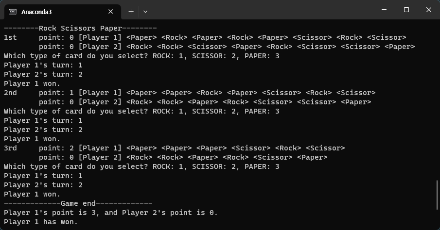

# Rock-Scissors-Paper



Rock scissors paper card game.

## Setup
Install python3.

## Download
```
$ cd my_path
$ git clone https://github.com/2Dthree/rock-scissors-paper.git
```

## Run
```
$ cd my_path/rock-scissors-paper
$ python rsp.py
```

## Rules
Each player has some rock scissors paper cards in his hand. Their hands are open to each other.

Every turn, two players play a card simultaneously, just like an usual rock scissors paper. However, the cards they used are thrown out of hand.

If at least one player run out of one type of cards, the game end. Player of more points wins.